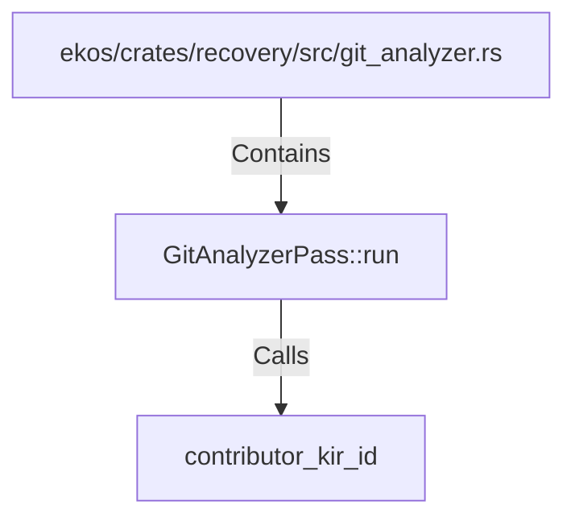

# GitAnalyzerPass::run (RustSymbol)

## Properties

| Key | Value |
|---|---|
| `kind` | method |

## Relationships

### Calls

- → contributor_kir_id (`5a81b1e4-5efa-5631-ae7a-388b4689ea5e`)

### Contains

- ← ekos/crates/recovery/src/git_analyzer.rs (`f908320d-aaa8-525a-9521-e6581d42da30`)

## Diagram

## Evidence

_No evidence cited._
