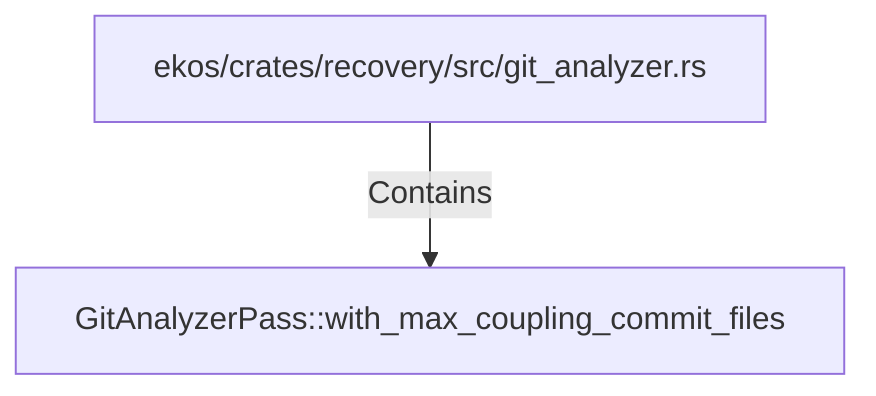

# GitAnalyzerPass::with_max_coupling_commit_files (RustSymbol)

## Properties

| Key | Value |
|---|---|
| `kind` | method |

## Relationships

### Contains

- ← ekos/crates/recovery/src/git_analyzer.rs (`f908320d-aaa8-525a-9521-e6581d42da30`)

## Diagram

## Evidence

_No evidence cited._
