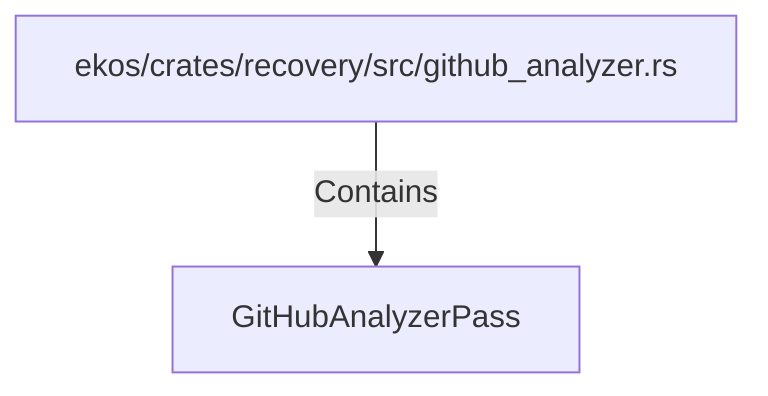

# GitHubAnalyzerPass (RustSymbol)

## Properties

| Key | Value |
|---|---|
| `kind` | struct |

## Relationships

### Contains

- ← ekos/crates/recovery/src/github_analyzer.rs (`09117129-0fa3-5361-a92f-97212fff36cb`)

## Diagram

## Evidence

_No evidence cited._
