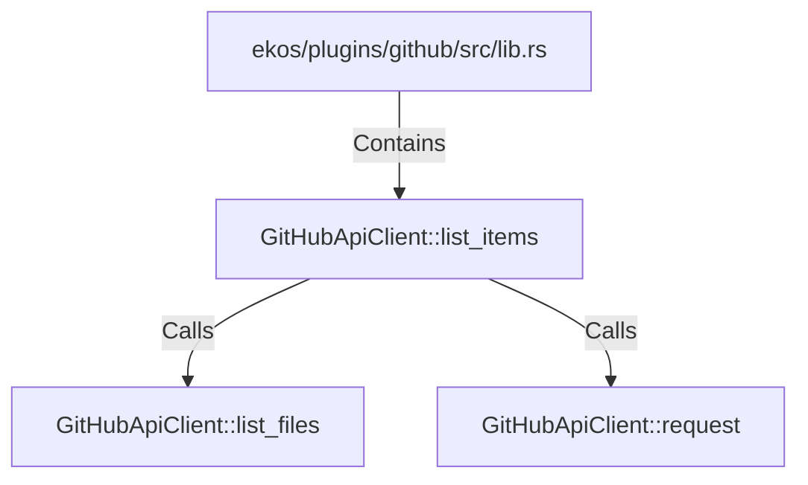

# GitHubApiClient::list_items (RustSymbol)

## Properties

| Key | Value |
|---|---|
| `kind` | method |

## Relationships

### Calls

- → GitHubApiClient::list_files (`a59fcb98-efa8-585f-adae-1552e1d6be08`)
- → GitHubApiClient::request (`a0b8024c-32d8-5121-8adb-250994e1cd0f`)

### Contains

- ← ekos/plugins/github/src/lib.rs (`85954c06-2c57-57ee-8a60-8a92c239ab70`)

## Diagram

## Evidence

_No evidence cited._
