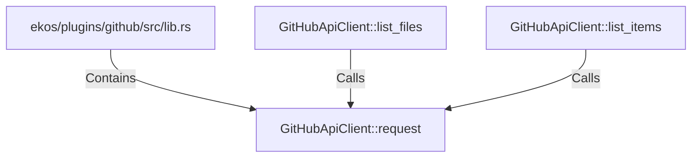

# GitHubApiClient::request (RustSymbol)

## Properties

| Key | Value |
|---|---|
| `kind` | method |

## Relationships

### Calls

- ← GitHubApiClient::list_files (`a59fcb98-efa8-585f-adae-1552e1d6be08`)
- ← GitHubApiClient::list_items (`28d915f2-b5a3-51e1-8f92-8a7e80a23664`)

### Contains

- ← ekos/plugins/github/src/lib.rs (`85954c06-2c57-57ee-8a60-8a92c239ab70`)

## Diagram

## Evidence

_No evidence cited._
