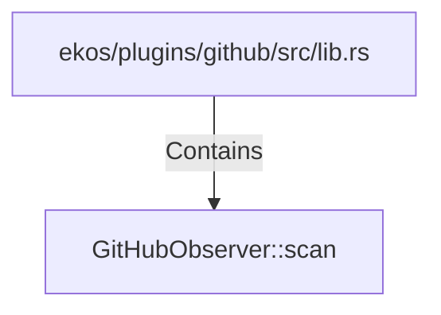

# GitHubObserver::scan (RustSymbol)

## Properties

| Key | Value |
|---|---|
| `kind` | method |

## Relationships

### Contains

- ← ekos/plugins/github/src/lib.rs (`85954c06-2c57-57ee-8a60-8a92c239ab70`)

## Diagram

## Evidence

_No evidence cited._
