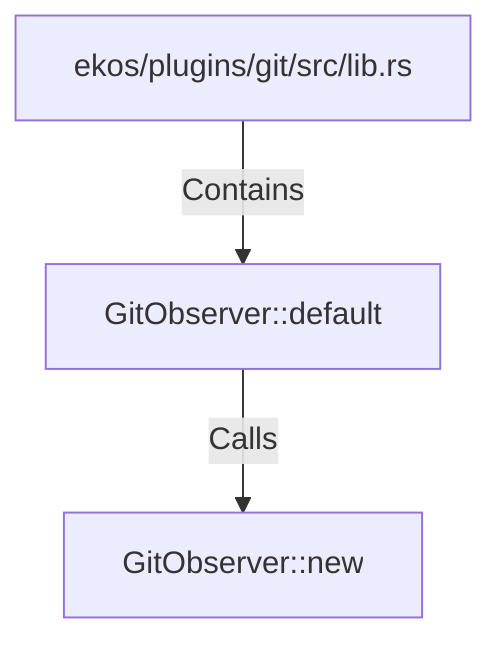

# GitObserver::default (RustSymbol)

## Properties

| Key | Value |
|---|---|
| `kind` | method |

## Relationships

### Calls

- → GitObserver::new (`320b790e-7671-52d0-a2c1-cd1e7f86c9e6`)

### Contains

- ← ekos/plugins/git/src/lib.rs (`8941bcba-6474-5c7b-af9e-97dc4f4f7a13`)

## Diagram

## Evidence

_No evidence cited._
