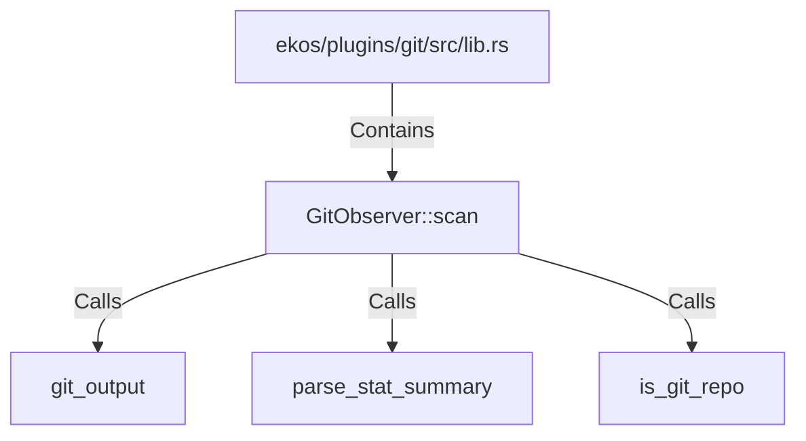

# GitObserver::scan (RustSymbol)

## Properties

| Key | Value |
|---|---|
| `kind` | method |

## Relationships

### Calls

- → git_output (`4fea6a2a-9edd-5378-abd5-b37ded47b483`)
- → parse_stat_summary (`2c446572-839f-5362-9f05-99e568697d62`)
- → is_git_repo (`cded5a1e-14f6-59b0-80ab-c13dc8216049`)

### Contains

- ← ekos/plugins/git/src/lib.rs (`8941bcba-6474-5c7b-af9e-97dc4f4f7a13`)

## Diagram

## Evidence

_No evidence cited._
