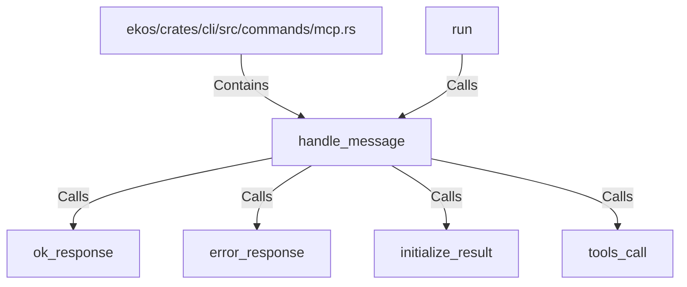

# handle_message (RustSymbol)

## Properties

| Key | Value |
|---|---|
| `kind` | function |

## Relationships

### Calls

- ← run (`6891f75c-d8b9-56a3-9f17-a6ae5a79a3b7`)
- → ok_response (`75923916-379c-5b98-a9b4-c4b9264c6d2d`)
- → error_response (`6e38d862-2134-5ff9-917b-9c7c56f49a8e`)
- → initialize_result (`45c28e0c-51c3-541d-899d-fdef70b6efb8`)
- → tools_call (`52440250-4db8-5d19-8d69-bf98b9de4bd1`)

### Contains

- ← ekos/crates/cli/src/commands/mcp.rs (`ff76bb73-9285-5295-927c-5cb33a5bbc25`)

## Diagram

## Evidence

_No evidence cited._
