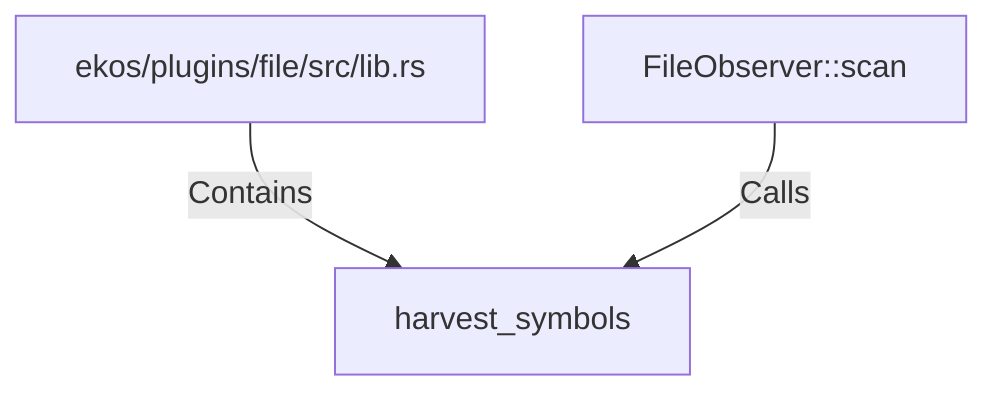

# harvest_symbols (RustSymbol)

## Properties

| Key | Value |
|---|---|
| `kind` | function |

## Relationships

### Calls

- ← FileObserver::scan (`e95c4e75-8026-5f8e-af77-90e6cd973ce3`)

### Contains

- ← ekos/plugins/file/src/lib.rs (`7cdc5253-6617-5e49-81c7-9e227a76c44b`)

## Diagram

## Evidence

_No evidence cited._
