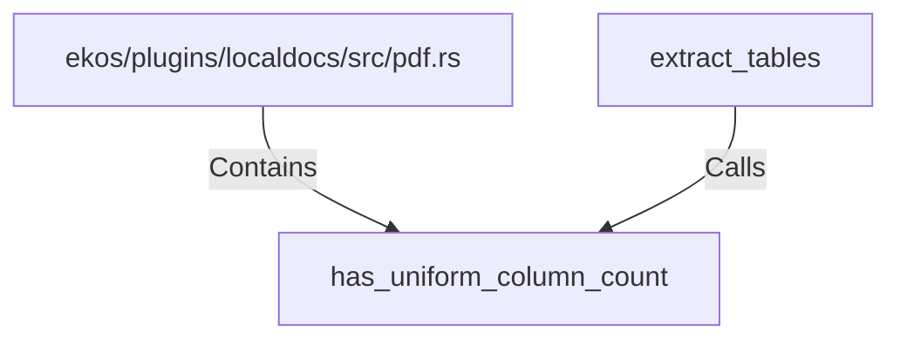

# has_uniform_column_count (RustSymbol)

## Properties

| Key | Value |
|---|---|
| `kind` | function |

## Relationships

### Calls

- ← extract_tables (`0c7c90b3-163e-50de-80ad-2b1b6ca89b49`)

### Contains

- ← ekos/plugins/localdocs/src/pdf.rs (`c8cae073-dd9b-50d2-8942-335d3cdf47b3`)

## Diagram

## Evidence

_No evidence cited._
