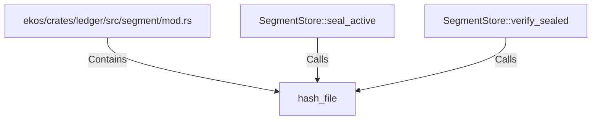

# hash_file (RustSymbol)

## Properties

| Key | Value |
|---|---|
| `kind` | function |

## Relationships

### Calls

- ← SegmentStore::seal_active (`f2a44d2b-2547-5a57-b0b3-ec7494028286`)
- ← SegmentStore::verify_sealed (`2ac5591d-1ae5-5ee2-8e32-44c92f6dae0d`)

### Contains

- ← ekos/crates/ledger/src/segment/mod.rs (`80a64e0a-b0ac-51df-b3be-128cddd1cc83`)

## Diagram

## Evidence

_No evidence cited._
