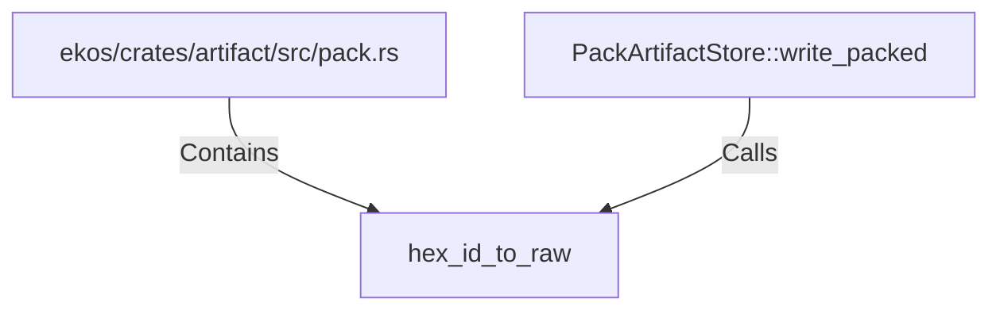

# hex_id_to_raw (RustSymbol)

## Properties

| Key | Value |
|---|---|
| `kind` | function |

## Relationships

### Calls

- ← PackArtifactStore::write_packed (`2c2ad043-598d-5fcb-bf2d-ed4347ca2ae6`)

### Contains

- ← ekos/crates/artifact/src/pack.rs (`98cd7507-d9e7-59e3-acfb-c7ffb05d9f73`)

## Diagram

## Evidence

_No evidence cited._
