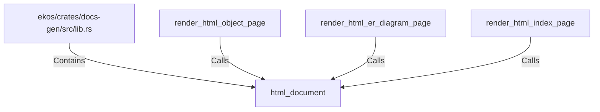

# html_document (RustSymbol)

## Properties

| Key | Value |
|---|---|
| `kind` | function |

## Relationships

### Calls

- ← render_html_object_page (`2c4b2f66-239c-55ad-bcda-4a963de9d84f`)
- ← render_html_er_diagram_page (`8365ac82-17c8-536e-90e4-5f4735d5899f`)
- ← render_html_index_page (`0949b466-2438-5f3b-a87b-35f285b85729`)

### Contains

- ← ekos/crates/docs-gen/src/lib.rs (`6ca4fba0-18e5-59b7-9876-7dae72e2ce0e`)

## Diagram

## Evidence

_No evidence cited._
