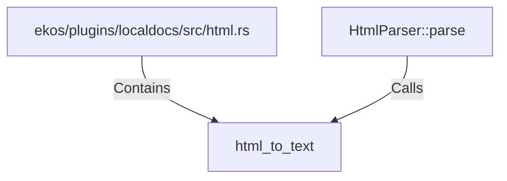

# html_to_text (RustSymbol)

## Properties

| Key | Value |
|---|---|
| `kind` | function |

## Relationships

### Calls

- ← HtmlParser::parse (`7d43ef03-d9aa-5afa-8592-2ecf225afeb4`)

### Contains

- ← ekos/plugins/localdocs/src/html.rs (`612a67f9-5373-59bf-827a-16b82d635d53`)

## Diagram

## Evidence

_No evidence cited._
