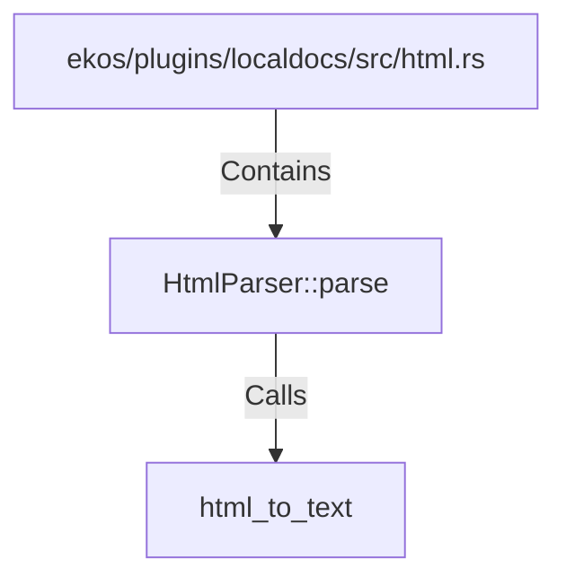

# HtmlParser::parse (RustSymbol)

## Properties

| Key | Value |
|---|---|
| `kind` | method |

## Relationships

### Calls

- → html_to_text (`c4bc6e8e-694a-5b32-b75a-f7b2e6e93b7c`)

### Contains

- ← ekos/plugins/localdocs/src/html.rs (`612a67f9-5373-59bf-827a-16b82d635d53`)

## Diagram

## Evidence

_No evidence cited._
