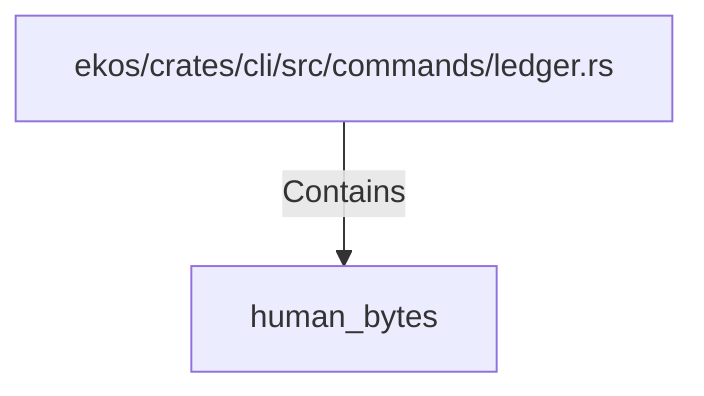

# human_bytes (RustSymbol)

## Properties

| Key | Value |
|---|---|
| `kind` | function |

## Relationships

### Contains

- ← ekos/crates/cli/src/commands/ledger.rs (`00bf5c8a-7198-5df3-a6eb-5bf22bc8ddcb`)

## Diagram

## Evidence

_No evidence cited._
