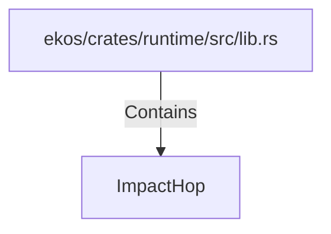

# ImpactHop (RustSymbol)

## Properties

| Key | Value |
|---|---|
| `kind` | struct |

## Relationships

### Contains

- ← ekos/crates/runtime/src/lib.rs (`7d8cf6bd-fac1-56d9-a742-4db7a455ab7c`)

## Diagram

## Evidence

_No evidence cited._
