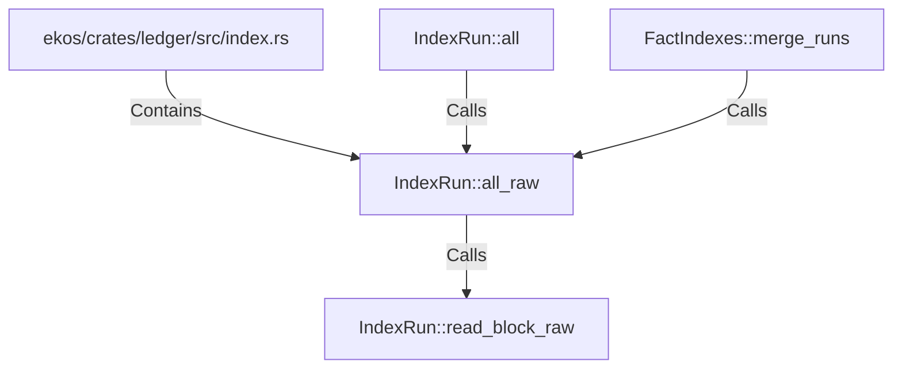

# IndexRun::all_raw (RustSymbol)

## Properties

| Key | Value |
|---|---|
| `kind` | method |

## Relationships

### Calls

- → IndexRun::read_block_raw (`d34fdca8-cb7f-5efa-bf77-acf0e6f3479b`)
- ← IndexRun::all (`fc613d47-220e-54bb-8822-c82bf2cacea4`)
- ← FactIndexes::merge_runs (`7656c624-f7b2-53e8-9af8-faafa094666c`)

### Contains

- ← ekos/crates/ledger/src/index.rs (`a43fa387-2cac-5166-bfc2-ae4c965fc2ac`)

## Diagram

## Evidence

_No evidence cited._
