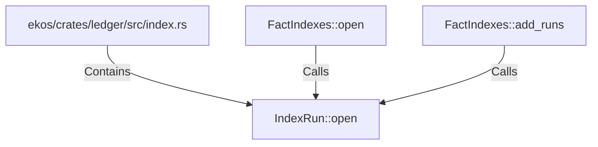

# IndexRun::open (RustSymbol)

## Properties

| Key | Value |
|---|---|
| `kind` | method |

## Relationships

### Calls

- ← FactIndexes::open (`99f8c0b5-50df-5dff-9d1d-b999395d24a1`)
- ← FactIndexes::add_runs (`4f62bd8f-a002-5bbb-8bc9-5c708f2849a5`)

### Contains

- ← ekos/crates/ledger/src/index.rs (`a43fa387-2cac-5166-bfc2-ae4c965fc2ac`)

## Diagram

## Evidence

_No evidence cited._
