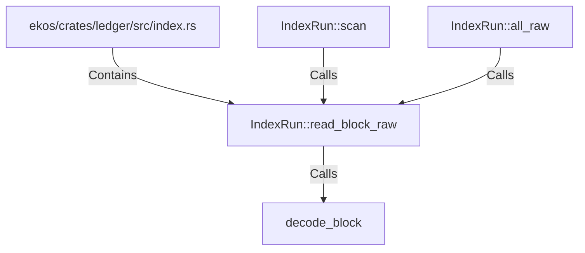

# IndexRun::read_block_raw (RustSymbol)

## Properties

| Key | Value |
|---|---|
| `kind` | method |

## Relationships

### Calls

- → decode_block (`b8a0bf10-9570-574c-a274-53930cfd176b`)
- ← IndexRun::scan (`b5797161-ebeb-5639-8a39-f3a0a5517ee2`)
- ← IndexRun::all_raw (`b5bb1598-06cb-5273-b6b4-ea02baf2112a`)

### Contains

- ← ekos/crates/ledger/src/index.rs (`a43fa387-2cac-5166-bfc2-ae4c965fc2ac`)

## Diagram

## Evidence

_No evidence cited._
