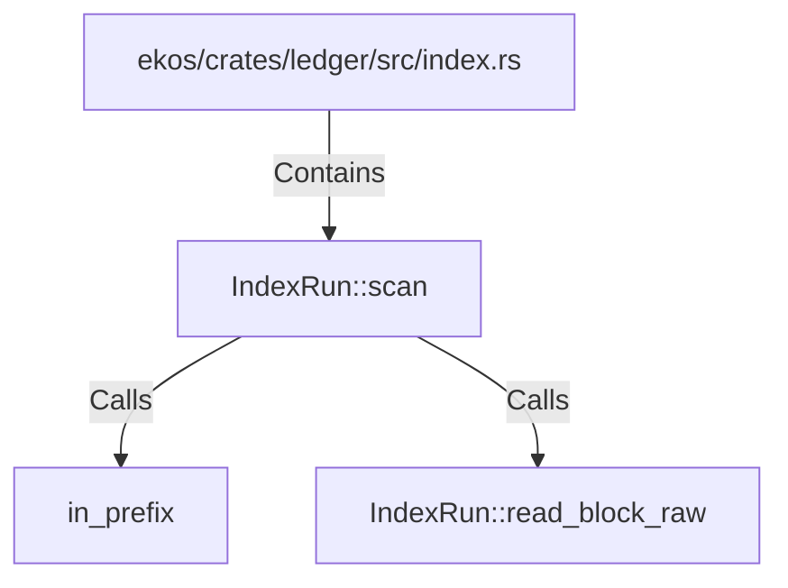

# IndexRun::scan (RustSymbol)

## Properties

| Key | Value |
|---|---|
| `kind` | method |

## Relationships

### Calls

- → in_prefix (`5aefd266-8072-5c7c-a7da-5e830d6c975d`)
- → IndexRun::read_block_raw (`d34fdca8-cb7f-5efa-bf77-acf0e6f3479b`)

### Contains

- ← ekos/crates/ledger/src/index.rs (`a43fa387-2cac-5166-bfc2-ae4c965fc2ac`)

## Diagram

## Evidence

_No evidence cited._
