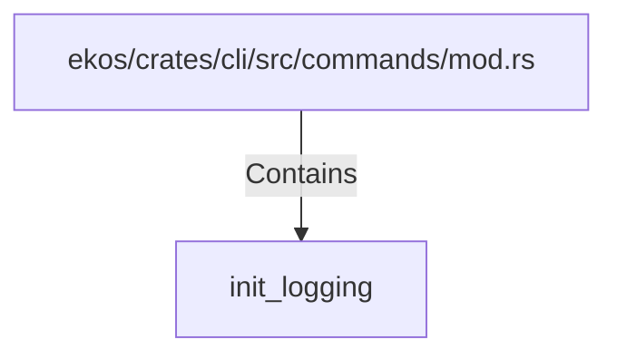

# init_logging (RustSymbol)

## Properties

| Key | Value |
|---|---|
| `kind` | function |

## Relationships

### Contains

- ← ekos/crates/cli/src/commands/mod.rs (`bf90b1ff-2e7e-599e-8d6e-12b2e6522003`)

## Diagram

## Evidence

_No evidence cited._
