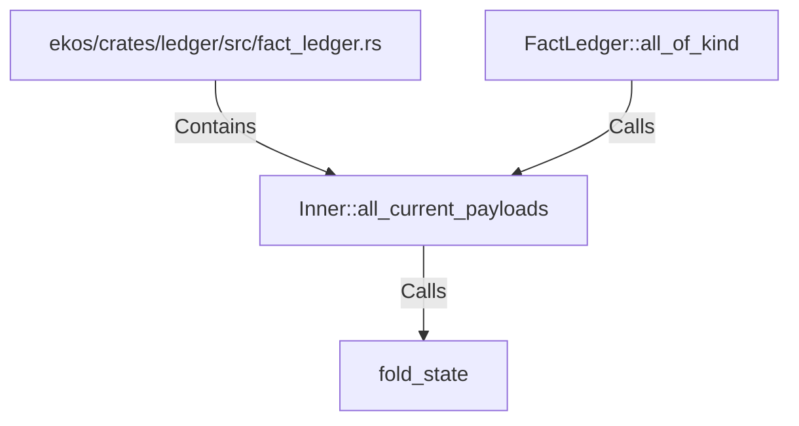

# Inner::all_current_payloads (RustSymbol)

## Properties

| Key | Value |
|---|---|
| `kind` | method |

## Relationships

### Calls

- ← FactLedger::all_of_kind (`96be8663-06e0-5092-9271-602b15b98872`)
- → fold_state (`42e75b53-6365-5fbc-83a1-26fcd87d8f3c`)

### Contains

- ← ekos/crates/ledger/src/fact_ledger.rs (`eadcb59e-818f-5d1e-af87-ff29aba11423`)

## Diagram

## Evidence

_No evidence cited._
