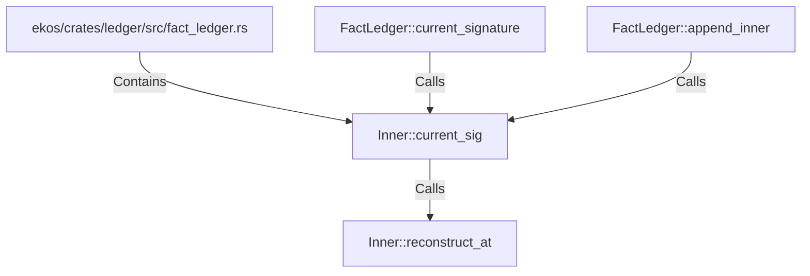

# Inner::current_sig (RustSymbol)

## Properties

| Key | Value |
|---|---|
| `kind` | method |

## Relationships

### Calls

- ← FactLedger::current_signature (`ce34047f-7c08-56f8-8b0f-7bb23b073282`)
- ← FactLedger::append_inner (`abbc13e0-8705-5d3c-aa78-d21e9a9882ee`)
- → Inner::reconstruct_at (`79bd7404-2990-533f-b4f5-b3d167543336`)

### Contains

- ← ekos/crates/ledger/src/fact_ledger.rs (`eadcb59e-818f-5d1e-af87-ff29aba11423`)

## Diagram

## Evidence

_No evidence cited._
