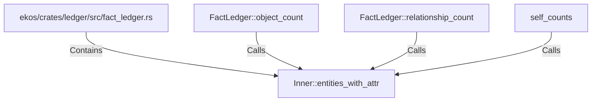

# Inner::entities_with_attr (RustSymbol)

## Properties

| Key | Value |
|---|---|
| `kind` | method |

## Relationships

### Calls

- ← FactLedger::object_count (`7b06e1e8-cc08-5acd-90b9-1e5223ddf52a`)
- ← FactLedger::relationship_count (`9930e168-65a3-57b3-95cc-29f7cd3aac53`)
- ← self_counts (`ce94f529-4432-555b-895b-41dffaad4ba6`)

### Contains

- ← ekos/crates/ledger/src/fact_ledger.rs (`eadcb59e-818f-5d1e-af87-ff29aba11423`)

## Diagram

## Evidence

_No evidence cited._
