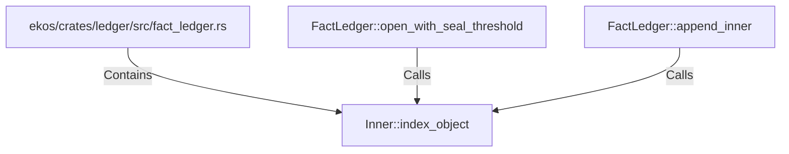

# Inner::index_object (RustSymbol)

## Properties

| Key | Value |
|---|---|
| `kind` | method |

## Relationships

### Calls

- ← FactLedger::open_with_seal_threshold (`50a7d9c4-7eb2-5d0c-9c80-5e2982e59574`)
- ← FactLedger::append_inner (`abbc13e0-8705-5d3c-aa78-d21e9a9882ee`)

### Contains

- ← ekos/crates/ledger/src/fact_ledger.rs (`eadcb59e-818f-5d1e-af87-ff29aba11423`)

## Diagram

## Evidence

_No evidence cited._
