# Inner::reconstruct_at (RustSymbol)

## Properties

| Key | Value |
|---|---|
| `kind` | method |

## Relationships

### Calls

- ← FactLedger::open_with_seal_threshold (`50a7d9c4-7eb2-5d0c-9c80-5e2982e59574`)
- ← FactLedger::typed_current (`70c6fe5b-8567-5988-b867-f2d5db8b76a8`)
- ← FactLedger::relationships_for (`9a0d2288-3396-581c-9545-542f0a759e37`)
- ← FactLedger::object_at (`57760afc-d78b-5593-ba0e-9d8b30d725ce`)
- ← FactLedger::relationships_at (`c47392f6-8e4b-54df-9316-0196d42d6f5d`)
- ← FactLedger::diff (`499f0ae3-66da-5863-8b37-46030a99f8e2`)
- ← self_counts (`ce94f529-4432-555b-895b-41dffaad4ba6`)
- → Inner::state_at (`f8ecc412-0c51-5275-8a0d-2f41777af9ac`)
- ← Inner::current_sig (`ba605f6f-3be3-5689-94ce-047beed35236`)

### Contains

- ← ekos/crates/ledger/src/fact_ledger.rs (`eadcb59e-818f-5d1e-af87-ff29aba11423`)

## Diagram

```mermaid
graph TD
    n79bd74042990533fb4f5b3d167543336["Inner::reconstruct_at"]
    neadcb59e818f5d1eaf87ff29aba11423["ekos/crates/ledger/src/fact_ledger.rs"]
    neadcb59e818f5d1eaf87ff29aba11423 -->|Contains| n79bd74042990533fb4f5b3d167543336
    n50a7d9c47eb25d0c9c805e2982e59574["FactLedger::open_with_seal_threshold"]
    n50a7d9c47eb25d0c9c805e2982e59574 -->|Calls| n79bd74042990533fb4f5b3d167543336
    n70c6fe5b85675988b867f2d5db8b76a8["FactLedger::typed_current"]
    n70c6fe5b85675988b867f2d5db8b76a8 -->|Calls| n79bd74042990533fb4f5b3d167543336
    n9a0d22883396581c9545542f0a759e37["FactLedger::relationships_for"]
    n9a0d22883396581c9545542f0a759e37 -->|Calls| n79bd74042990533fb4f5b3d167543336
    n57760afcd78b5593ba0e9d8b30d725ce["FactLedger::object_at"]
    n57760afcd78b5593ba0e9d8b30d725ce -->|Calls| n79bd74042990533fb4f5b3d167543336
    nc47392f68e4b54df93160196d42d6f5d["FactLedger::relationships_at"]
    nc47392f68e4b54df93160196d42d6f5d -->|Calls| n79bd74042990533fb4f5b3d167543336
    n499f0ae366da58638b3746030a99f8e2["FactLedger::diff"]
    n499f0ae366da58638b3746030a99f8e2 -->|Calls| n79bd74042990533fb4f5b3d167543336
    nce94f5294432555b895b41dffaad4ba6["self_counts"]
    nce94f5294432555b895b41dffaad4ba6 -->|Calls| n79bd74042990533fb4f5b3d167543336
    nf8ecc4120c5152758a0d2f41777af9ac["Inner::state_at"]
    n79bd74042990533fb4f5b3d167543336 -->|Calls| nf8ecc4120c5152758a0d2f41777af9ac
    nba605f6f3be3568994ce047beed35236["Inner::current_sig"]
    nba605f6f3be3568994ce047beed35236 -->|Calls| n79bd74042990533fb4f5b3d167543336
```

## Evidence

_No evidence cited._
