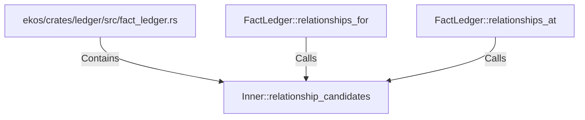

# Inner::relationship_candidates (RustSymbol)

## Properties

| Key | Value |
|---|---|
| `kind` | method |

## Relationships

### Calls

- ← FactLedger::relationships_for (`9a0d2288-3396-581c-9545-542f0a759e37`)
- ← FactLedger::relationships_at (`c47392f6-8e4b-54df-9316-0196d42d6f5d`)

### Contains

- ← ekos/crates/ledger/src/fact_ledger.rs (`eadcb59e-818f-5d1e-af87-ff29aba11423`)

## Diagram

## Evidence

_No evidence cited._
