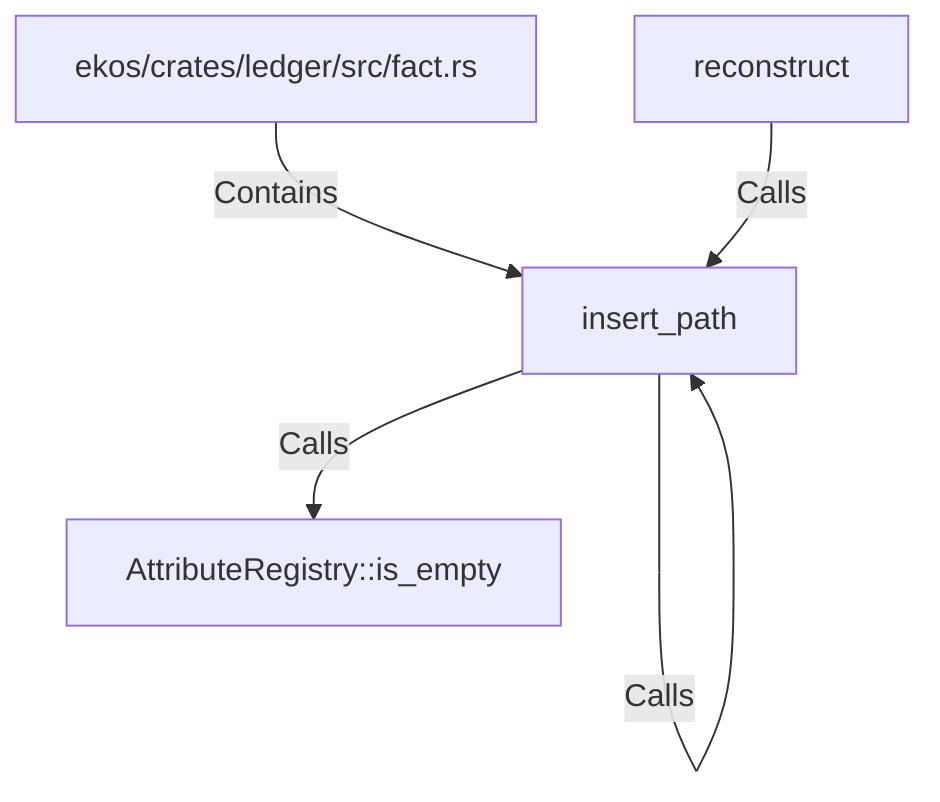

# insert_path (RustSymbol)

## Properties

| Key | Value |
|---|---|
| `kind` | function |

## Relationships

### Calls

- ← reconstruct (`5afc145c-c6ce-5e30-9ac5-52b81dd3b22b`)
- → AttributeRegistry::is_empty (`9cdd0396-a4a6-5ba7-b142-40240858e67e`)
- → insert_path (`3e14b1d6-e8f1-5a15-b5f9-d69f821b67cb`)

### Contains

- ← ekos/crates/ledger/src/fact.rs (`7837f9fa-7178-5151-a068-e75361336c37`)

## Diagram

## Evidence

_No evidence cited._
