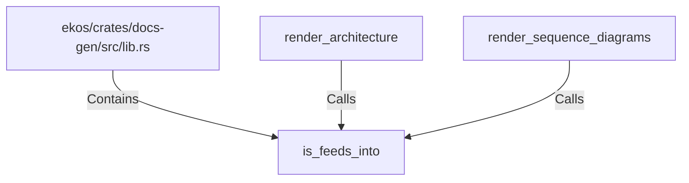

# is_feeds_into (RustSymbol)

## Properties

| Key | Value |
|---|---|
| `kind` | function |

## Relationships

### Calls

- ← render_architecture (`f75f757e-c643-5e43-b04b-48d13123d04b`)
- ← render_sequence_diagrams (`76f24b81-7126-591a-bfa9-c22e46862167`)

### Contains

- ← ekos/crates/docs-gen/src/lib.rs (`6ca4fba0-18e5-59b7-9876-7dae72e2ce0e`)

## Diagram

## Evidence

_No evidence cited._
