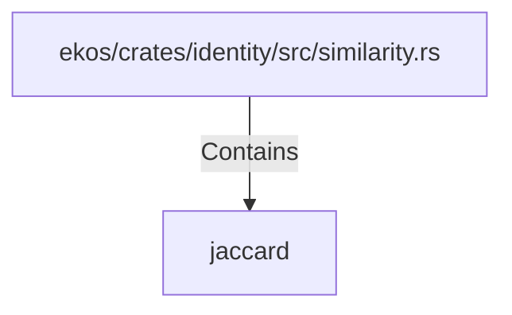

# jaccard (RustSymbol)

## Properties

| Key | Value |
|---|---|
| `kind` | function |

## Relationships

### Contains

- ← ekos/crates/identity/src/similarity.rs (`e66f3285-3368-5aa7-be23-fe2abc068cad`)

## Diagram

## Evidence

_No evidence cited._
