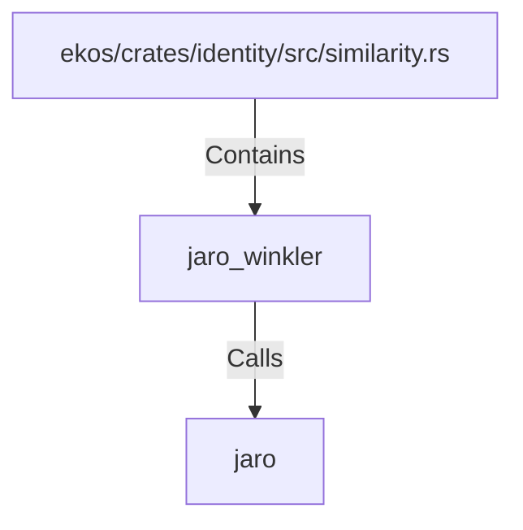

# jaro_winkler (RustSymbol)

## Properties

| Key | Value |
|---|---|
| `kind` | function |

## Relationships

### Calls

- → jaro (`f1d110a2-c493-5a5e-b46d-3474efa8c1ce`)

### Contains

- ← ekos/crates/identity/src/similarity.rs (`e66f3285-3368-5aa7-be23-fe2abc068cad`)

## Diagram

## Evidence

_No evidence cited._
