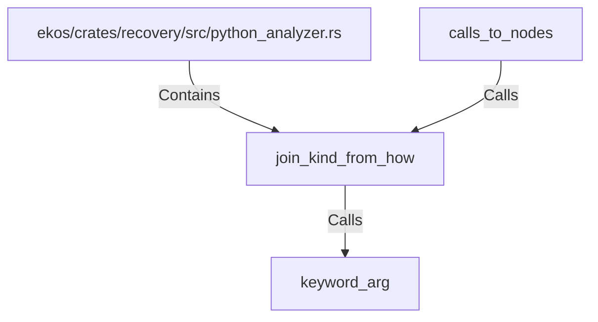

# join_kind_from_how (RustSymbol)

## Properties

| Key | Value |
|---|---|
| `kind` | function |

## Relationships

### Calls

- → keyword_arg (`d64243b2-605e-5af2-9373-b2f6483c166a`)
- ← calls_to_nodes (`73d9612b-4af4-5e0f-b10f-ddfc27015e27`)

### Contains

- ← ekos/crates/recovery/src/python_analyzer.rs (`196ca3fd-e85c-5ab9-a142-50f63dc586b9`)

## Diagram

## Evidence

_No evidence cited._
