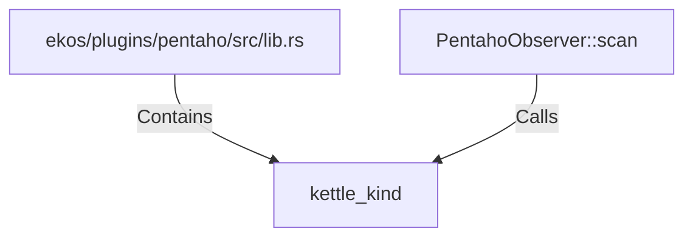

# kettle_kind (RustSymbol)

## Properties

| Key | Value |
|---|---|
| `kind` | function |

## Relationships

### Calls

- ← PentahoObserver::scan (`b2b9f45c-fe9a-5e4e-aabf-fb2da6ac56f8`)

### Contains

- ← ekos/plugins/pentaho/src/lib.rs (`cebff2b5-8142-5508-b8ad-01561647c1cc`)

## Diagram

## Evidence

_No evidence cited._
