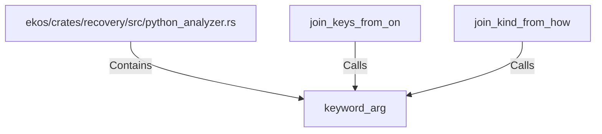

# keyword_arg (RustSymbol)

## Properties

| Key | Value |
|---|---|
| `kind` | function |

## Relationships

### Calls

- ← join_keys_from_on (`340e9495-92d1-56c4-adb1-a881b61f5e07`)
- ← join_kind_from_how (`50c6eef6-d1fe-5900-af7a-31a4ef604197`)

### Contains

- ← ekos/crates/recovery/src/python_analyzer.rs (`196ca3fd-e85c-5ab9-a142-50f63dc586b9`)

## Diagram

## Evidence

_No evidence cited._
