# kind_of_payload (RustSymbol)

## Properties

| Key | Value |
|---|---|
| `kind` | function |

## Relationships

### Calls

- ← FactLedger::open_with_seal_threshold (`50a7d9c4-7eb2-5d0c-9c80-5e2982e59574`)
- ← FactLedger::append_inner (`abbc13e0-8705-5d3c-aa78-d21e9a9882ee`)
- ← FactLedger::typed_current (`70c6fe5b-8567-5988-b867-f2d5db8b76a8`)
- ← FactLedger::all_of_kind (`96be8663-06e0-5092-9271-602b15b98872`)
- ← FactLedger::relationships_for (`9a0d2288-3396-581c-9545-542f0a759e37`)
- ← FactLedger::object_at (`57760afc-d78b-5593-ba0e-9d8b30d725ce`)
- ← FactLedger::relationships_at (`c47392f6-8e4b-54df-9316-0196d42d6f5d`)

### Contains

- ← ekos/crates/ledger/src/fact_ledger.rs (`eadcb59e-818f-5d1e-af87-ff29aba11423`)

## Diagram

```mermaid
graph TD
    nabd8ce5ae66350cea42fe2c4a13c43fb["kind_of_payload"]
    neadcb59e818f5d1eaf87ff29aba11423["ekos/crates/ledger/src/fact_ledger.rs"]
    neadcb59e818f5d1eaf87ff29aba11423 -->|Contains| nabd8ce5ae66350cea42fe2c4a13c43fb
    n50a7d9c47eb25d0c9c805e2982e59574["FactLedger::open_with_seal_threshold"]
    n50a7d9c47eb25d0c9c805e2982e59574 -->|Calls| nabd8ce5ae66350cea42fe2c4a13c43fb
    nabbc13e087055d3caa78d21e9a9882ee["FactLedger::append_inner"]
    nabbc13e087055d3caa78d21e9a9882ee -->|Calls| nabd8ce5ae66350cea42fe2c4a13c43fb
    n70c6fe5b85675988b867f2d5db8b76a8["FactLedger::typed_current"]
    n70c6fe5b85675988b867f2d5db8b76a8 -->|Calls| nabd8ce5ae66350cea42fe2c4a13c43fb
    n96be866306e050929271602b15b98872["FactLedger::all_of_kind"]
    n96be866306e050929271602b15b98872 -->|Calls| nabd8ce5ae66350cea42fe2c4a13c43fb
    n9a0d22883396581c9545542f0a759e37["FactLedger::relationships_for"]
    n9a0d22883396581c9545542f0a759e37 -->|Calls| nabd8ce5ae66350cea42fe2c4a13c43fb
    n57760afcd78b5593ba0e9d8b30d725ce["FactLedger::object_at"]
    n57760afcd78b5593ba0e9d8b30d725ce -->|Calls| nabd8ce5ae66350cea42fe2c4a13c43fb
    nc47392f68e4b54df93160196d42d6f5d["FactLedger::relationships_at"]
    nc47392f68e4b54df93160196d42d6f5d -->|Calls| nabd8ce5ae66350cea42fe2c4a13c43fb
```

## Evidence

_No evidence cited._
