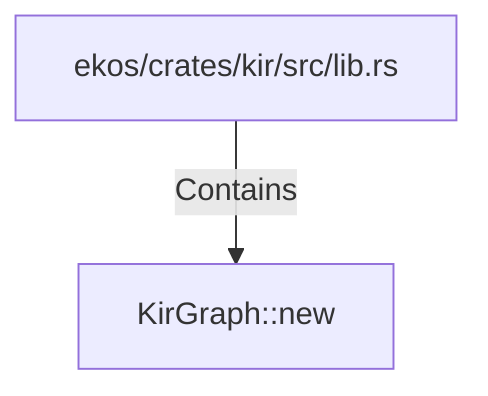

# KirGraph::new (RustSymbol)

## Properties

| Key | Value |
|---|---|
| `kind` | method |

## Relationships

### Contains

- ← ekos/crates/kir/src/lib.rs (`078a10d5-8141-5e74-b89d-7120ec1be4f8`)

## Diagram

## Evidence

_No evidence cited._
