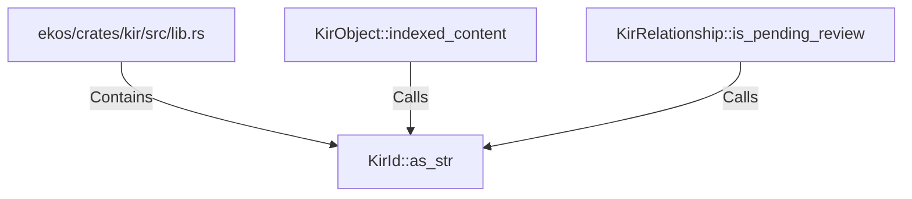

# KirId::as_str (RustSymbol)

## Properties

| Key | Value |
|---|---|
| `kind` | method |

## Relationships

### Calls

- ← KirObject::indexed_content (`47de4d6e-f31c-5894-b4c7-03e40a20cde4`)
- ← KirRelationship::is_pending_review (`0d3b089a-3d02-5f05-b09d-34e6ebb0c2a1`)

### Contains

- ← ekos/crates/kir/src/lib.rs (`078a10d5-8141-5e74-b89d-7120ec1be4f8`)

## Diagram

## Evidence

_No evidence cited._
