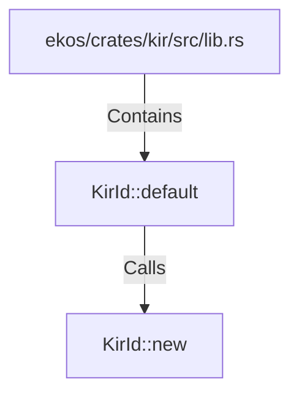

# KirId::default (RustSymbol)

## Properties

| Key | Value |
|---|---|
| `kind` | method |

## Relationships

### Calls

- → KirId::new (`872ec2c4-fad6-53d5-94a8-e69cec09bdf7`)

### Contains

- ← ekos/crates/kir/src/lib.rs (`078a10d5-8141-5e74-b89d-7120ec1be4f8`)

## Diagram

## Evidence

_No evidence cited._
