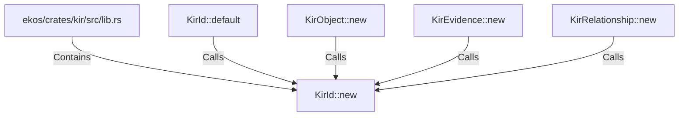

# KirId::new (RustSymbol)

## Properties

| Key | Value |
|---|---|
| `kind` | method |

## Relationships

### Calls

- ← KirId::default (`260ed478-da17-59ed-a655-7164be3887e4`)
- ← KirObject::new (`665a7287-e7d7-5668-b61b-75b73ea62707`)
- ← KirEvidence::new (`68500468-1708-5dea-ba07-641484d0a488`)
- ← KirRelationship::new (`17b4566a-87c4-59ef-80e1-fa8e4808b3b7`)

### Contains

- ← ekos/crates/kir/src/lib.rs (`078a10d5-8141-5e74-b89d-7120ec1be4f8`)

## Diagram

## Evidence

_No evidence cited._
