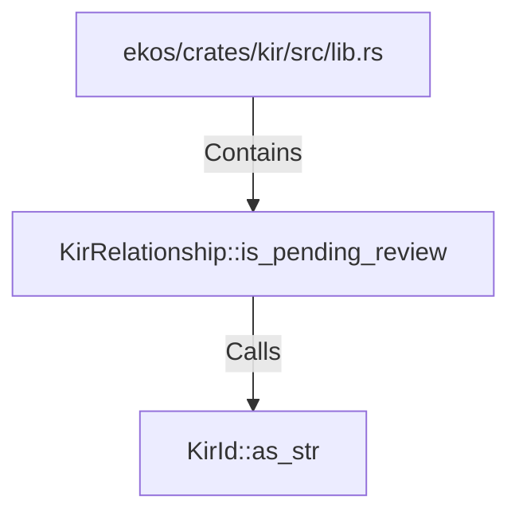

# KirRelationship::is_pending_review (RustSymbol)

## Properties

| Key | Value |
|---|---|
| `kind` | method |

## Relationships

### Calls

- → KirId::as_str (`c7e0d8fe-6c43-5cc9-ae6c-57b9e19b247f`)

### Contains

- ← ekos/crates/kir/src/lib.rs (`078a10d5-8141-5e74-b89d-7120ec1be4f8`)

## Diagram

## Evidence

_No evidence cited._
