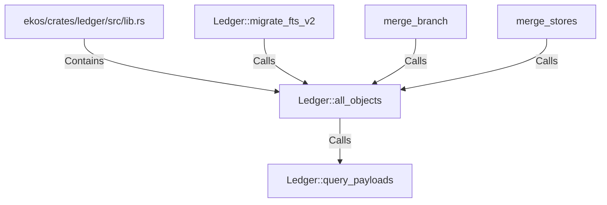

# Ledger::all_objects (RustSymbol)

## Properties

| Key | Value |
|---|---|
| `kind` | method |

## Relationships

### Calls

- ← Ledger::migrate_fts_v2 (`2c3a50d1-1ba0-54fd-8509-2493f809dc4c`)
- → Ledger::query_payloads (`b8401b6d-6d8d-5633-9b6a-27c093ab2db6`)
- ← merge_branch (`16be84c8-16f2-5d63-8dff-104f7296fc29`)
- ← merge_stores (`35e9663b-3b6d-50ec-ad16-9721c45eb3d1`)

### Contains

- ← ekos/crates/ledger/src/lib.rs (`21938f45-b767-5933-9e71-12e15ff53eb1`)

## Diagram

## Evidence

_No evidence cited._
