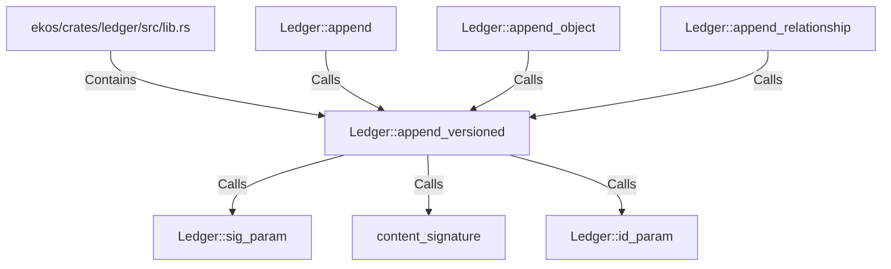

# Ledger::append_versioned (RustSymbol)

## Properties

| Key | Value |
|---|---|
| `kind` | method |

## Relationships

### Calls

- → Ledger::sig_param (`7fdb2fc5-6ebf-53bb-b836-1757fcdea43d`)
- → content_signature (`66c7da48-70e5-57fb-9882-5a5b05933963`)
- → Ledger::id_param (`f3cddd93-ac14-5ec3-bb44-011407d55f49`)
- ← Ledger::append (`7b3089e3-ed30-5f52-bc3c-a296097d3b8f`)
- ← Ledger::append_object (`b71bb7ad-337a-518f-9b6e-316178f45928`)
- ← Ledger::append_relationship (`7cfea349-6f7b-5501-8b20-1291291d672b`)

### Contains

- ← ekos/crates/ledger/src/lib.rs (`21938f45-b767-5933-9e71-12e15ff53eb1`)

## Diagram

## Evidence

_No evidence cited._
