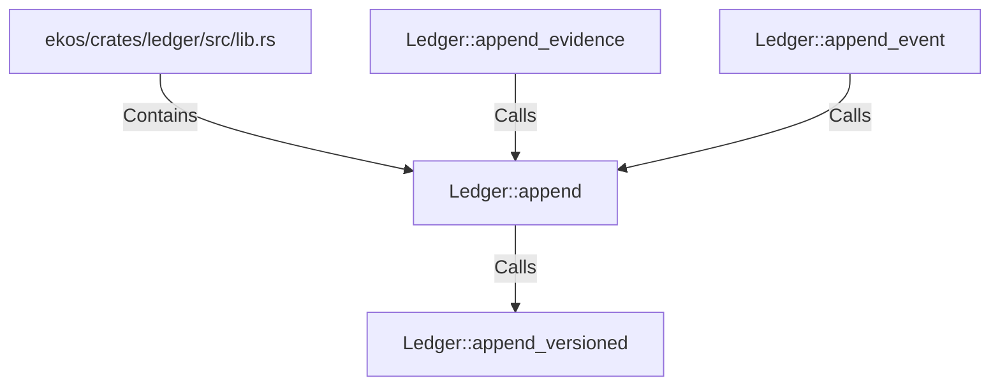

# Ledger::append (RustSymbol)

## Properties

| Key | Value |
|---|---|
| `kind` | method |

## Relationships

### Calls

- → Ledger::append_versioned (`fd02b8da-192d-585b-a46d-996b4095186c`)
- ← Ledger::append_evidence (`46d35bf5-9fac-5d57-bfb9-856246acd8b7`)
- ← Ledger::append_event (`0605f067-82d6-503b-9400-c9879e68fe96`)

### Contains

- ← ekos/crates/ledger/src/lib.rs (`21938f45-b767-5933-9e71-12e15ff53eb1`)

## Diagram

## Evidence

_No evidence cited._
