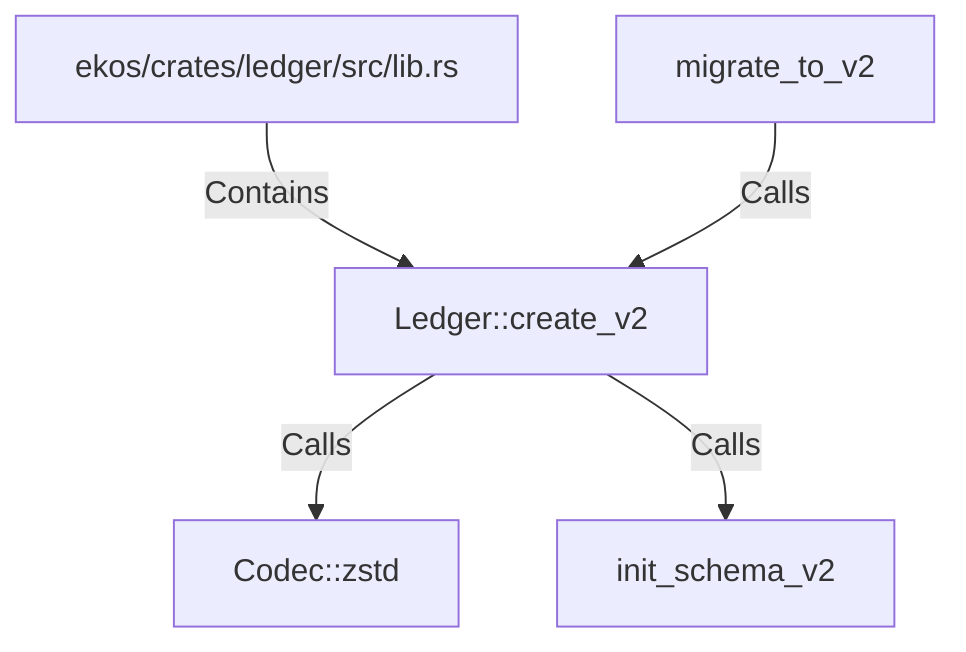

# Ledger::create_v2 (RustSymbol)

## Properties

| Key | Value |
|---|---|
| `kind` | method |

## Relationships

### Calls

- → Codec::zstd (`90b5c6e9-ab20-5f91-af23-dfa3538059e2`)
- → init_schema_v2 (`229e4c1f-d398-5b84-8348-2003c40d9865`)
- ← migrate_to_v2 (`fee5c44c-a2e1-59db-bf5d-b63aff20f8c9`)

### Contains

- ← ekos/crates/ledger/src/lib.rs (`21938f45-b767-5933-9e71-12e15ff53eb1`)

## Diagram

## Evidence

_No evidence cited._
