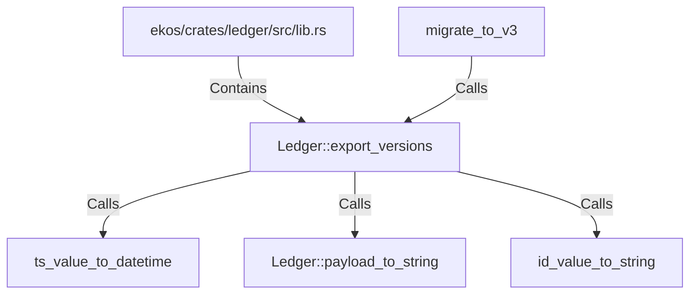

# Ledger::export_versions (RustSymbol)

## Properties

| Key | Value |
|---|---|
| `kind` | method |

## Relationships

### Calls

- → ts_value_to_datetime (`34ebc45d-e426-5788-9f8b-c605bf91a6a3`)
- → Ledger::payload_to_string (`b30e2764-552e-5d3e-a1e5-34c523dd7475`)
- → id_value_to_string (`a0c3d0ec-3294-5534-a1f2-b2295cc7d77a`)
- ← migrate_to_v3 (`1dab3f65-615b-56e9-ae9b-e92c32a2cb63`)

### Contains

- ← ekos/crates/ledger/src/lib.rs (`21938f45-b767-5933-9e71-12e15ff53eb1`)

## Diagram

## Evidence

_No evidence cited._
