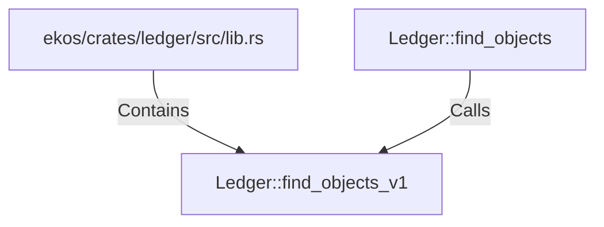

# Ledger::find_objects_v1 (RustSymbol)

## Properties

| Key | Value |
|---|---|
| `kind` | method |

## Relationships

### Calls

- ← Ledger::find_objects (`00beea88-f9ec-5c1b-88bb-7bc1fedb8fa8`)

### Contains

- ← ekos/crates/ledger/src/lib.rs (`21938f45-b767-5933-9e71-12e15ff53eb1`)

## Diagram

## Evidence

_No evidence cited._
