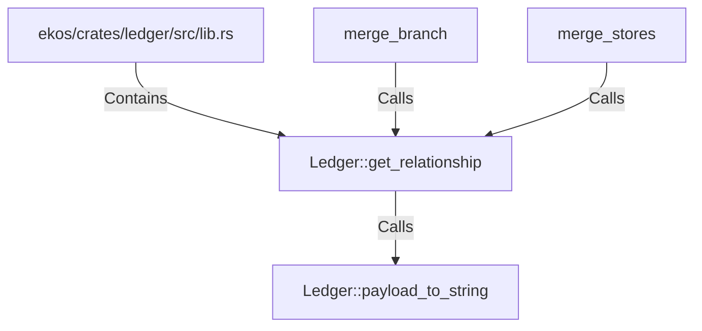

# Ledger::get_relationship (RustSymbol)

## Properties

| Key | Value |
|---|---|
| `kind` | method |

## Relationships

### Calls

- → Ledger::payload_to_string (`b30e2764-552e-5d3e-a1e5-34c523dd7475`)
- ← merge_branch (`16be84c8-16f2-5d63-8dff-104f7296fc29`)
- ← merge_stores (`35e9663b-3b6d-50ec-ad16-9721c45eb3d1`)

### Contains

- ← ekos/crates/ledger/src/lib.rs (`21938f45-b767-5933-9e71-12e15ff53eb1`)

## Diagram

## Evidence

_No evidence cited._
