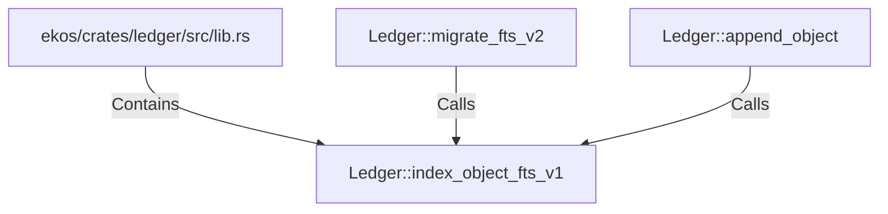

# Ledger::index_object_fts_v1 (RustSymbol)

## Properties

| Key | Value |
|---|---|
| `kind` | method |

## Relationships

### Calls

- ← Ledger::migrate_fts_v2 (`2c3a50d1-1ba0-54fd-8509-2493f809dc4c`)
- ← Ledger::append_object (`b71bb7ad-337a-518f-9b6e-316178f45928`)

### Contains

- ← ekos/crates/ledger/src/lib.rs (`21938f45-b767-5933-9e71-12e15ff53eb1`)

## Diagram

## Evidence

_No evidence cited._
